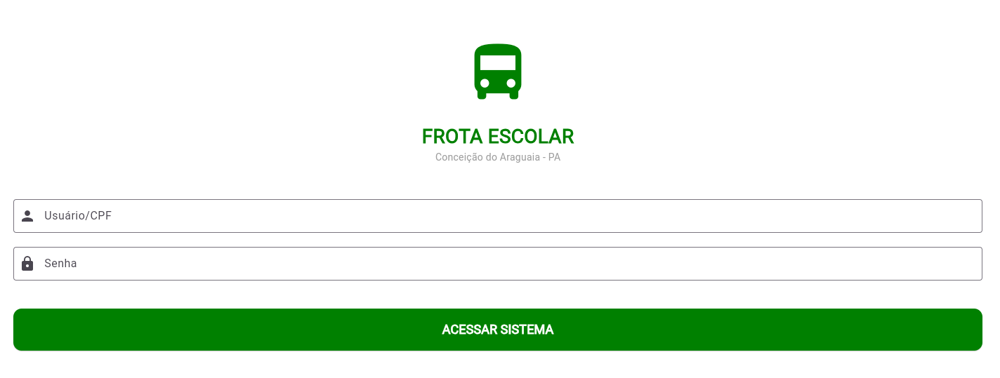
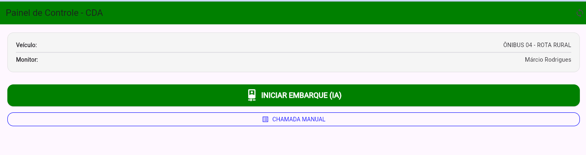
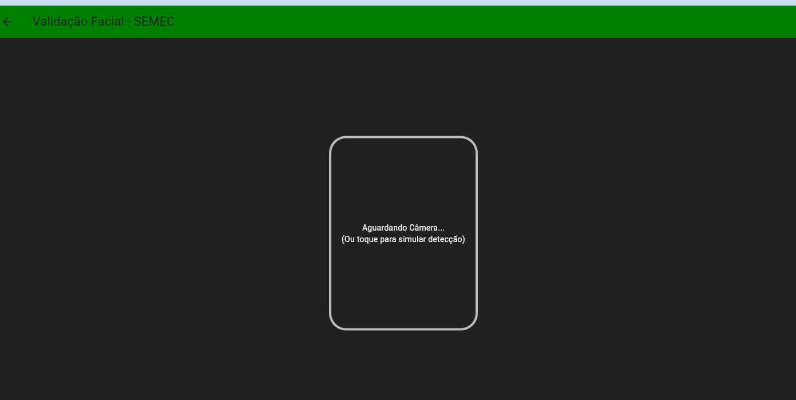
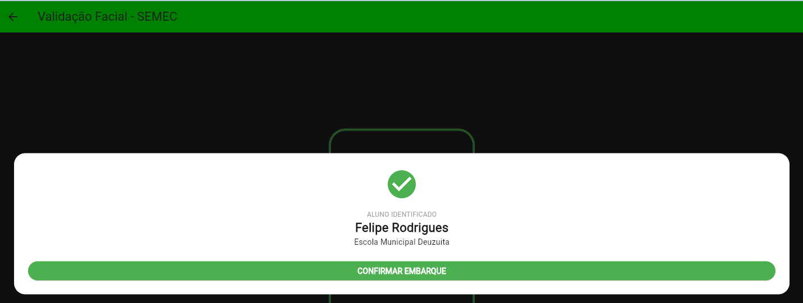
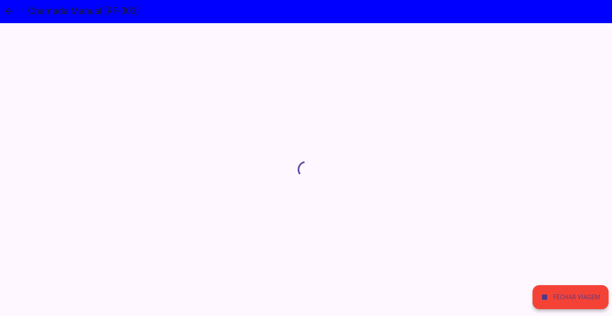
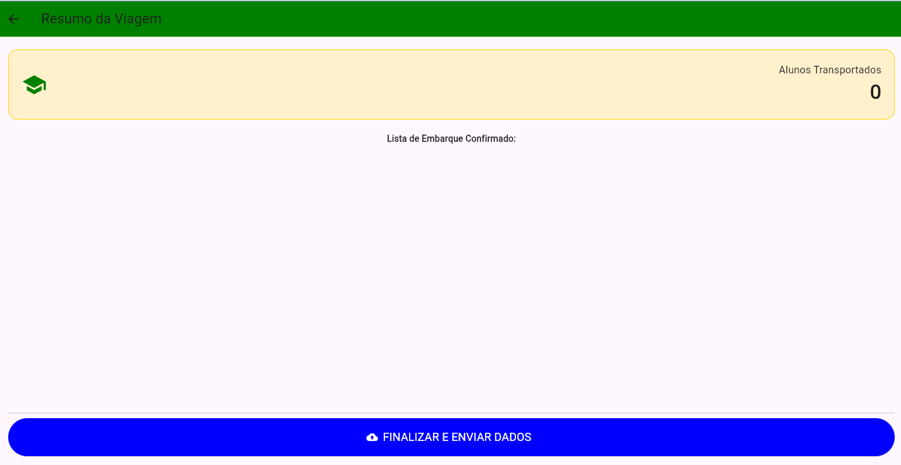
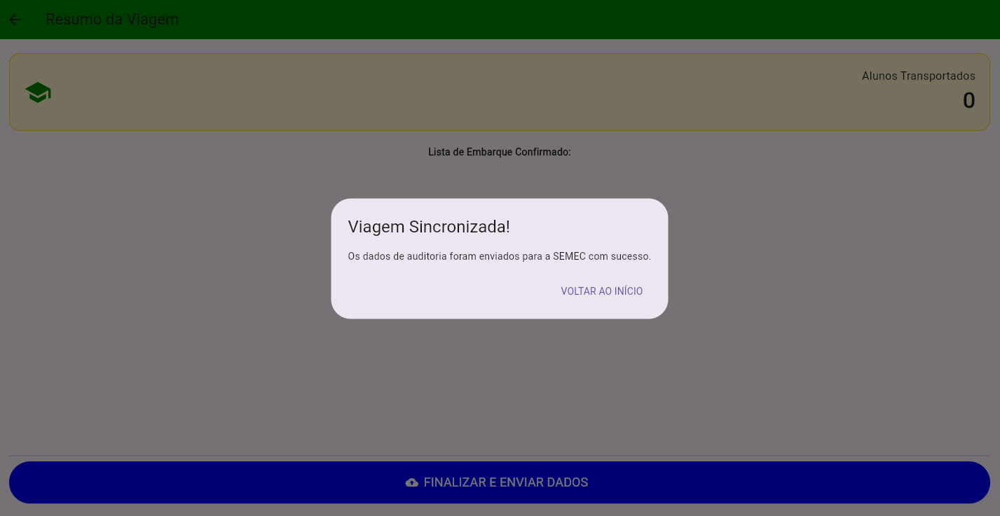

# Demonstração do Sistema BusEscolar

A seguir estão algumas telas do aplicativo.

---

## Tela 1 – Dashboard

---

## Tela 2 – Validação Facial

---

## Tela 3 – Confirmação de Embarque

---

## Tela 4 – Registro Manual

---

## Tela 5 – Rastreamento GPS

---

## Tela 6 – Relatório de Viagem

---

## Tela 7 – Histórico de Rotas

